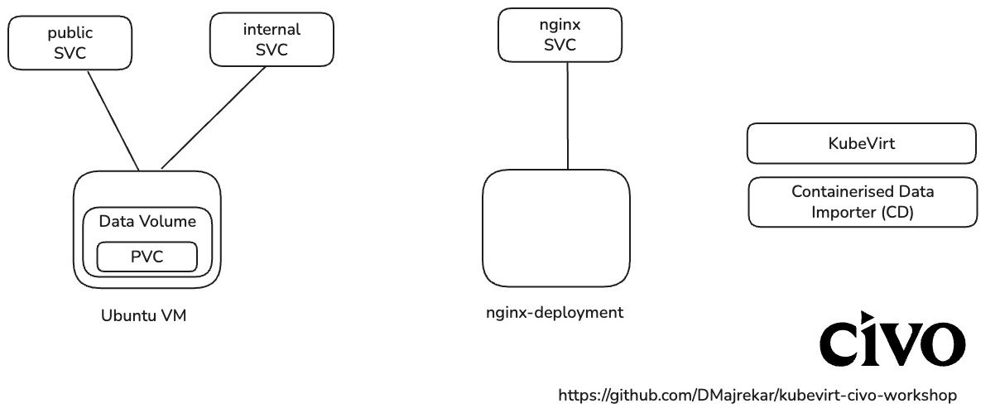

# KubeVirt Virtual Machines on Civo Kubernetes Workshop

This workshop demonstrates how to run virtual machines (VMs) on Kubernetes using KubeVirt and Civo's managed Kubernetes platform. You'll learn to create VMs, deploy services within them, and establish bidirectional communication between VMs and Kubernetes cluster services.

## Architecture Overview



This diagram shows the complete workshop architecture, demonstrating how VMs integrate with Kubernetes services, storage, and external access through Civo's LoadBalancer.

## Workshop Overview

By the end of this workshop, you will have:

- Created a Kubernetes cluster on Civo
- Installed and configured KubeVirt
- Validated KubeVirt with a lightweight CirrOS VM
- Installed CDI for full Linux VM support
- Created and managed Ubuntu virtual machines
- Deployed services within VMs
- Established bidirectional communication between VMs and Kubernetes services
- Exposed VM services to the internet via LoadBalancer

## Prerequisites

Before starting this workshop, ensure you have:

- **Civo workshop account** - Sign up at [civo.com](https://www.civo.com)
- **kubectl** - Kubernetes command-line tool ([installation guide](https://kubernetes.io/docs/tasks/tools/))
- **virtctl** - We'll guide you through the installation during the workshop

## Getting Started

1. **Clone this repository**
   ```bash
   git clone https://github.com/your-username/kubevirt-civo-workshop.git
   cd kubevirt-civo-workshop
   ```

## Workshop Structure

This workshop is organized into step-by-step directories:

```
kubevirt-civo-workshop/
├── step-01-cluster-setup/          # Civo cluster creation
├── step-02-kubevirt-installation/  # KubeVirt operator setup
├── step-03-initial-vm-validation/  # CirrOS VM for validation
├── step-04-cdi-installation/       # CDI for full Linux VMs
├── step-05-vm-creation/            # Ubuntu VM creation
├── step-06-vm-services/            # Deploy services in VMs
├── step-07-expose-services/        # Kubernetes service exposure
├── step-08-vm-to-cluster/          # Test VM → cluster communication
├── step-09-external-access/        # LoadBalancer for internet access
├── step-99-cleanup/                # Resource cleanup
├── docs/                           # Additional documentation
├── CLAUDE.md                       # Claude Code automation
└── README.md                       # This workshop guide
```

## Workshop Steps

Follow these step-by-step guides:

1. **[Step 1: Civo Cluster Setup](step-01-cluster-setup/)** - Create and configure your Kubernetes cluster
2. **[Step 2: KubeVirt Installation](step-02-kubevirt-installation/)** - Install KubeVirt operator and components
3. **[Step 3: Initial VM Validation](step-03-initial-vm-validation/)** - Install virtctl and validate with CirrOS VM
4. **[Step 4: CDI Installation](step-04-cdi-installation/)** - Install CDI for full Linux VM support
5. **[Step 5: VM Creation](step-05-vm-creation/)** - Create Ubuntu VMs using CDI DataVolumes
6. **[Step 6: VM Services](step-06-vm-services/)** - Deploy applications within VMs
7. **[Step 7: Expose Services](step-07-expose-services/)** - Expose VM services via Kubernetes
8. **[Step 8: VM to Cluster](step-08-vm-to-cluster/)** - Test VM → cluster communication
9. **[Step 9: External Access](step-09-external-access/)** - Expose services to the internet
10. **[Step 99: Cleanup](step-99-cleanup/)** - Clean up all workshop resources

Each step contains:
- Clear objectives and prerequisites
- Detailed instructions
- Relevant files and manifests
- Troubleshooting guidance
- Links to the next step

## Troubleshooting

For detailed troubleshooting information, see [docs/troubleshooting.md](docs/troubleshooting.md).

### Quick Fixes

1. **VM Won't Start**
   ```bash
   kubectl describe vm testvm
   kubectl get events --field-selector involvedObject.name=testvm
   ```

2. **Can't Connect to VM Console**
   - Ensure VM is running: `kubectl get vmis`
   - Check VM events: `kubectl describe vmi testvm`

3. **Service Not Accessible**
   - Check service endpoints: `kubectl get endpoints testvm-service`
   - Verify VM is running and service is active inside VM

4. **LoadBalancer External IP Pending**
   - This is normal on Civo, it may take 2-5 minutes
   - Check service status: `kubectl describe svc testvm-loadbalancer`

## What You've Learned

- How to set up KubeVirt on a Kubernetes cluster
- Creating and managing virtual machines in Kubernetes
- Running services within VMs
- Networking between VMs and Kubernetes services
- Exposing VM services to the internet
- The power of combining traditional VMs with cloud-native Kubernetes

## Next Steps

- Explore more KubeVirt features like persistent storage
- Try different VM operating systems
- Implement more complex networking scenarios
- Look into VM migration capabilities

## Resources

- [KubeVirt Documentation](https://kubevirt.io/)
- [KubeVirt Labs](https://kubevirt.io/labs/)
- [Civo Documentation](https://www.civo.com/docs)
- [kubectl Reference](https://kubernetes.io/docs/reference/kubectl/)
